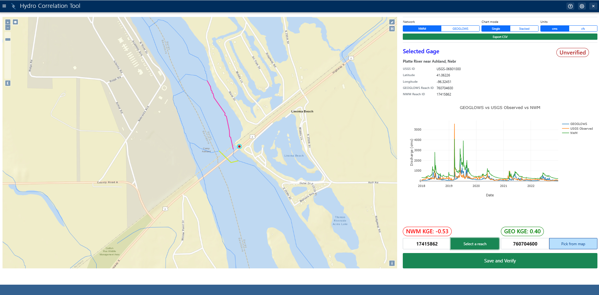
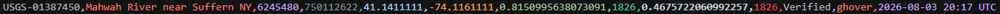

# Hydro Correlation Tool



A (currently) single-user scientific workbench (Tethys Platform app) for building and maintaining a high-quality cross-mapping table that links each active **USGS streamflow gage** to its corresponding **NWM v3 reach** (`feature_id`) and **GEOGLOWS v2 river** (`river_id`).

Because these three datasets use different IDs and geometries for the same rivers, a curated cross-mapping table is needed to connect them. The tool works in two stages:

1. **Offline seeding** — a standalone Python/GeoPandas notebook produces a first-pass seed (~70% accurate) by spatially matching gages to reaches.
2. **Interactive verification** — a researcher reviews each gage in the web app: inspecting hydrographs, correcting wrong reach assignments (by typing an ID or clicking the correct reach on the map), and marking each record verified. The corrected, human-verified table is the deliverable and is exportable as a csv through the app.

## Tech stack

- **Tethys Platform** (Django-based) with PostgreSQL/PostGIS
- **OpenLayers** for the map (via the Tethys MapView gizmo)
- **MapBox Vector Tiles** for the NWM / GEOGLOWS stream networks
- **Plotly** for hydrographs, comes from a CDN
- **Bootstrap 5** + jQuery
- **NWM retrospective, USGS, and GEOGLOWS APIs**

## These instructions are for developers running their own instance. Curators don't install anything, they get an account on the hosted portal.

### Prerequisites
1. [Tethys Platform](https://docs.tethysplatform.org/en/stable/installation.html#download-and-install-the-tethys-platform-package) >= 4.0.0 (installer creates a conda environment)

### Steps
1. Clone the repo and activate your [Tethys environment](https://docs.tethysplatform.org/en/stable/supplementary/virtual_environment.html#activate-environment):
   ```bash
   git clone https://github.com/gwenhover/hydro-correlation-tool.git
   cd hydro-correlation-tool
   conda activate <your environment>
   ```
   All remaining commands run from inside this directory.

2. Configure and start the Tethys database:
   ```bash
   tethys settings --set DATABASES.default.ENGINE django.db.backends.postgresql
   tethys settings --set DATABASES.default.DIR psql --set DATABASES.default.PORT 5436
   tethys db configure
   ```
   `tethys db configure` creates, initializes, and starts the bundled PostgreSQL cluster.
   On later sessions the database won't be running — start it with `tethys db start`.

3. Create a database service for the app and install it:
   ```bash
   tethys services create persistent -n hct_postgre -c tethys_super:pass@localhost:5436
   tethys install -d -q
   tethys link persistent:hct_postgre hydro_correlation_tool:ps_database:primary_db
   ```
   `tethys_super`/`pass` are the Tethys defaults created by `tethys db configure`.

4. Set the API keys:
   ```
   tethys app_settings set hydro_correlation_tool "MapBox PK Token" <token> 
   tethys app_settings set hydro_correlation_tool "USGS API Token"  <token> (optional)
   tethys app_settings set hydro_correlation_tool "NWM API Token"   <token>
   ```
5. Create tables + seed ~9,100 rows (slow, don't Ctrl-C):
   ```
   tethys syncstores hydro_correlation_tool
   ```
6. Start the portal
   ```
   tethys start
   ```
7. Navigate to http://localhost:8000/apps/hydro-correlation-tool/ in a browser to see the app
8. Log in with username 'admin' and password 'pass'
9. Click 'register' in the top right corner and create an account

## Troubleshooting
- **Database showing "on port None.."?** If tethys db start reports on port None, your portal_config.yml is missing PORT under DATABASES.default. Add it, or start the cluster directly:
  ```
  pg_ctl -D <db_dir>/data -l <db_dir>/logfile -o "-p <port>" start
  ```

- **JS/CSS edits not showing up?** This install serves *collected* static files, so a browser refresh isn't enough — run:
  ```
  tethys manage collectstatic
  ```
  then hard-refresh (Ctrl+Shift+R).
- **Stream tiles blank / 401?** The custom settings are not set or are set incorrectly (see setup step 4).
- **Projection convention:** all *data* stays in **EPSG:4326** (gage GeoJSON, coordinates); the *map view* runs in **EPSG:3857** (required by the vector tiles). Transform 4326 → 3857 only at the display boundary.
- **Connection refused... port 5436** Database isn't running (doesn't survive a wsl reboot)

## Usage
A user verifies a gage through this process:
1. Click on a red (unverified) gage -> see the gage + seeded reaches data on the right panel.
2. Inspect the reaches' locations on the map, relative to the gage, as well as the hydrograph and kge data mentioned above
3. Test other reaches (if necessary) and find the best fit for this particular gage
4. Type the corresponding IDs into the box above "Save and Verify", or pick the reaches off the map (recommended)
5. Click "Save and Verify"
6. Confirm
7. Move to the next gage

**Relevant information and definitions**:
- Each gage can have one of these statuses:
   - Verified: User confirmed, preprocessing seed got both the IDs correct
   - Edited: User confirmed, preprocessing seed got at least one ID incorrect
   - Unverified: Not user confirmed
- KGE: Stands for Kling Gupta Efficiency rating and is a statistical metric for evaluating how well a model lines up with observed data. This app uses a color system outlined below:
   - Green (good): KGE ≥ 0.3 
   - Yellow (moderate): -0.41 ≤ KGE < 0.3
   - Red (poor): KGE < -0.41

   Note that the KGE rating is not the final factor in deciding if a reach corresponds to a certain gage. Sometimes a model vastly overpredicts but still has the correct timing, which could lead to a red KGE score while being the correct reach.
- Pink highlighted reaches are the seeded best guess of the preprocessing notebook, yellow reaches are currently selected.
- Multi-user attribution. The app records the logged-in username in last_modified_by on every save. If several curators share a portal, give each their own account rather than sharing admin — otherwise the column can't tell you who verified what. On our portal that's done with ENABLE_OPEN_SIGNUP plus ENABLE_RESTRICTED_APP_ACCESS, with users added to a Curators group that grants access to this app. Accounts provide attribution, not concurrency safety — see Known limitations.

## Output
The output and end-goal of this app is a table that contains the corresponding USGS, NWM, and GEOGLOWS reach IDs. The table currently has 14 columns:
```
    usgs_id
    gage_name
    latitude
    longitude
    geom
    nwm_feature_id
    nwm_kge_rating
    nwm_kge_shared_dates
    geoglows_river_id
    geoglows_kge_rating
    geoglows_kge_shared_dates
    verification_status
    last_modified_by
    last_modified_timestamp
```

An example row looks like:


## Known bugs and future work

**Future Work (in progress)**
- Add a "snap to next gage" feature
- Add a "review table" below the map
- Cache all seeded NWM and GEOGLOWS data
- Map legend
- Update the tour that currently runs, as it is out of date

**Bugs and Limitations (being worked on)**
- First time fetching NWM data can take up to 45 seconds
- Single user app -- cannot currently handle multiple users caching or saving at the same time

## Development notes
- public/data/seed.csv is what ```syncstores``` loads into the DB
- The gage layer loads from `tethysapp/hydro_correlation_tool/public/data/merged_gages.geojson` (~9,100 active CONUS gages).
- Regenerate that file with the notebook in [`preprocessing/`](preprocessing/), which merges the USGS gage list with reach IDs, filters to CONUS, and prefixes each id as `USGS-…`.

## Project context

Part of a CIROH / BYU / Aquaveo effort. PI: Dan Ames · Lead architect: Sudip Pathak· Implementation: Gwen Hover.
